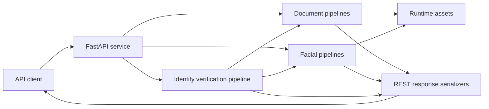
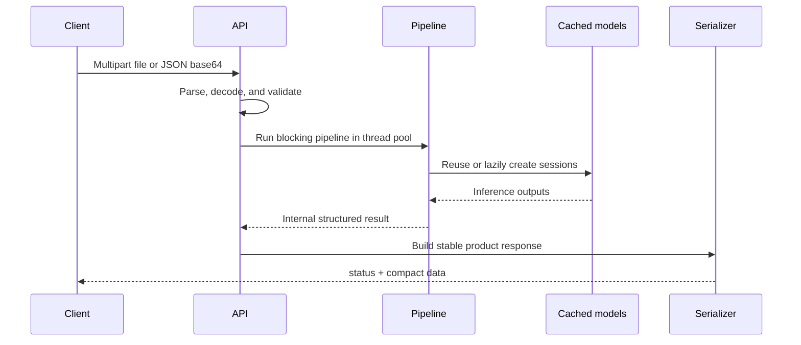
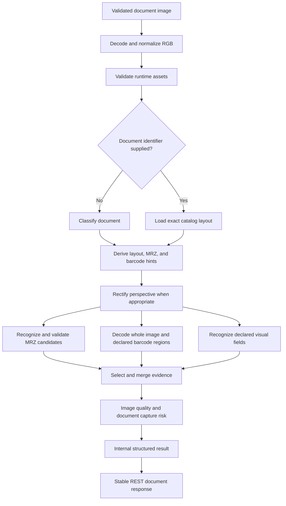
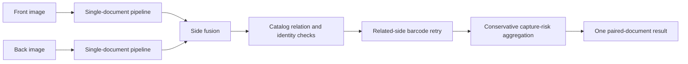
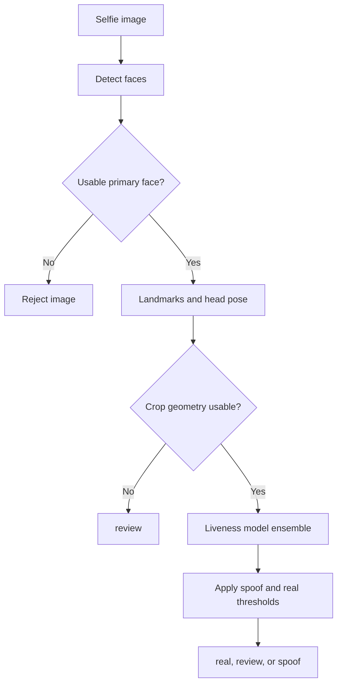
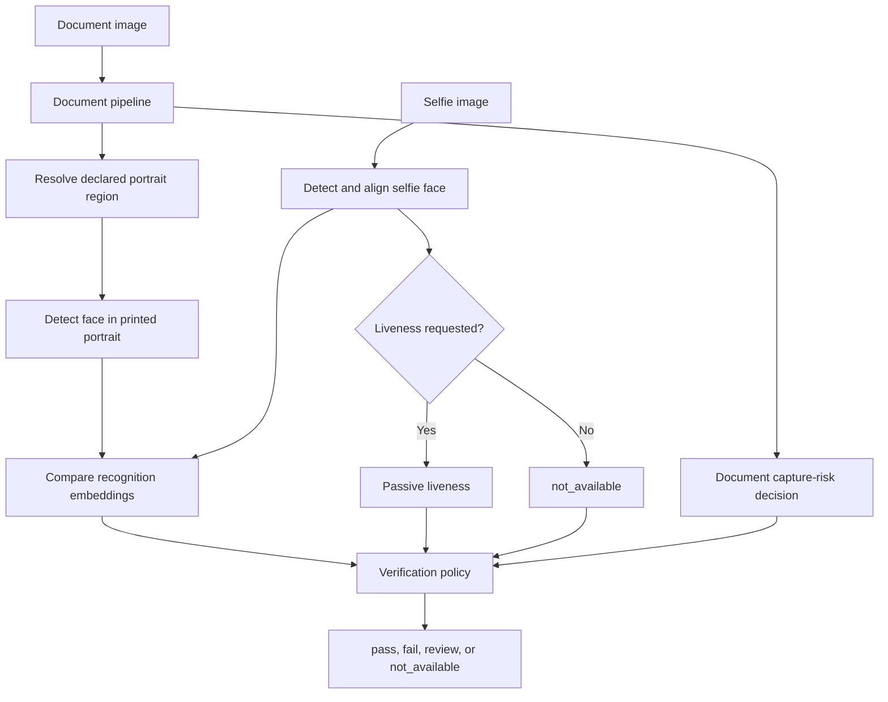

# Pipeline Architecture

## Purpose

Identity Analysis Runtime exposes several related pipelines behind one HTTP
service:

1. document classification and OCR;
2. paired-side and multi-page document fusion;
3. face detection, landmarks, pose, and quality;
4. passive facial liveness;
5. face-template extraction and comparison;
6. document-portrait to selfie verification.

The pipelines share image decoding, cached inference sessions, runtime assets,
request validation, and stable REST serializers. They remain separate at the
inference layer so callers can run only the analysis required by their use
case.

## Reading Map

| Question | Section |
|---|---|
| Which settings can be changed safely? | [Configuration Model](#configuration-model) |
| Which endpoint invokes which pipeline? | [Pipeline Entry Points](#pipeline-entry-points) |
| How does document recognition select and merge evidence? | [Document Pipeline](#document-pipeline) |
| How do detection, liveness, and recognition differ? | [Facial Pipelines](#facial-pipelines) |
| How is the final identity decision produced? | [Document-to-Selfie Verification](#document-to-selfie-verification) |
| Which objects are cached and when? | [Concurrency and Model Lifecycle](#concurrency-and-model-lifecycle) |
| How is a new document or model added? | [Extension Points](#extension-points) |

## System Context

The service is stateless between requests. Model sessions and immutable
catalogs are process-level caches; submitted images and temporary files are
request-scoped.

## Configuration Model

Not every pipeline parameter has the same stability or extension cost. The
runtime separates configuration into four surfaces:

| Surface | Examples | Change mechanism | Scope |
|---|---|---|---|
| Request options | `profile`, `documentIdentifier`, `fields`, `threshold`, `includeImages` | REST multipart or JSON input | One request |
| Runtime environment | asset root, upload limit, page limit, warm-up, host, port | Environment variables | One service process |
| Asset metadata | document regions, masks, locale, orientation, relations, barcode format | Rebuild and validate the asset bundle | All requests using that bundle |
| Calibrated policy | face quality limits, detector thresholds, document PAD threshold, model preprocessing | Code and regression tests | All requests after deployment |

Request options are the safest customization surface. Asset metadata is the
preferred surface for adding document editions because it changes geometry and
field semantics without creating a new orchestration path. Calibrated policy
constants should not be changed as operational toggles: they require a
representative evaluation set and documented acceptance criteria.

### Customization Boundary

| Parameter family | Publicly configurable? | Reason |
|---|---|---|
| Document route or exact layout | Yes, per request | Allows the caller to remove known ambiguity |
| Exact-layout field subset | Yes, per request | Reduces unnecessary OCR work |
| Image, portrait, liveness, and template additions | Yes, per request | These stages have explicit cost and privacy impact |
| Face comparison and liveness thresholds | Yes, per request | They are deployment policy and require calibration |
| Upload and page limits | Yes, by environment | They are service capacity and abuse-control settings |
| Catalog geometry, masks, locale, and relations | Yes, through validated assets | They belong to the document definition |
| Detector confidence and overlap suppression | No | They are coupled to detector calibration |
| Face-quality geometry and pose limits | No | They define one versioned quality policy |
| OCR candidate padding and early-stop confidence | No | They are implementation-level accuracy and performance policy |
| Document PAD threshold | No | It is coupled to model calibration |
| Pipeline executor sizes | No | Fixed bounds prevent request-driven oversubscription |
| ONNX execution provider | No | Current product packaging supports CPU execution consistently |
| ONNX intra-op and inter-op threads | Yes, by environment | Defaults bound per-session native thread creation |

“No” means the value is not a supported REST or environment contract. It can
be changed in source for an evaluated deployment, but the change should include
benchmarks, regression tests, capability documentation, and a policy version
when response semantics are affected.

### Runtime Environment

| Variable | Default | Effect |
|---|---:|---|
| `IDENTITY_ANALYSIS_ASSETS` | repository `assets` directory; `/app/assets` in Docker | Selects the complete model, catalog, charset, and layout bundle |
| `IDENTITY_ANALYSIS_MAX_UPLOAD_BYTES` | `20971520` | Maximum decoded bytes for each submitted image |
| `IDENTITY_ANALYSIS_MAX_DOCUMENT_PAGES` | `10` | Maximum images accepted by the multi-page pipeline |
| `IDENTITY_ANALYSIS_WARMUP` | `true` | Preloads document, face-detection, and landmark sessions at startup |
| `IDENTITY_ANALYSIS_ONNX_INTRA_OP_THREADS` | `1` | Native worker threads inside one ONNX operator |
| `IDENTITY_ANALYSIS_ONNX_INTER_OP_THREADS` | `1` | Parallel graph branches inside one ONNX session |
| `IDENTITY_ANALYSIS_HOST` | `0.0.0.0` | HTTP bind address |
| `IDENTITY_ANALYSIS_PORT` | `8000` | HTTP bind port |

Changing the asset root changes every model-backed capability together. The
bundle is validated before inference; files with incorrect hashes, missing
entries, or incompatible manifests fail rather than silently falling back.

### Request-Level Pipeline Selection

| Caller knowledge | Recommended option | Work avoided |
|---|---|---|
| Nothing beyond the image | `profile=auto_research` | Nothing; the runtime determines compatible routes |
| Known machine-readable family | Explicit `profile` | Incompatible MRZ, barcode, and dedicated visual routes |
| Exact catalog edition | Exact-layout endpoint plus `documentIdentifier` | Classification and layout ambiguity |
| Exact edition and required fields | Exact-layout endpoint plus repeated `fields` | Classification and OCR of unrequested visual regions |
| OCR fields only | Leave `includeImages` and `analyzePortraits` disabled | Region encoding and facial detection |

An option that reduces work does not weaken structural acceptance. For example,
an explicit MRZ profile still requires a parseable MRZ with its applicable
checks; an exact layout still requires OCR, MRZ, barcode, or dedicated-profile
evidence before the document is marked recognized.

## Architectural Layers

| Layer | Main modules | Responsibility |
|---|---|---|
| Transport | `api.py` | Parse multipart or JSON input, enforce limits, dispatch blocking work to the thread pool, and translate failures into HTTP errors |
| Orchestration | `pipeline.py`, `face_engines.py`, `facial_identity.py` | Select stages, coordinate inference, fuse evidence, and produce internal results |
| Document interpretation | `document_classifier.py`, `visual_layouts.py`, `ocr.py`, `barcodes.py` | Classify documents, read declared regions, recognize text, validate masks, and decode machine-readable data |
| Image analysis | `rectification.py`, `quality.py`, `document_liveness.py`, `metadata_integrity.py` | Rectify document geometry and calculate quality or capture-risk signals |
| Facial inference | `face_engines.py`, `facial_identity.py` | Detect and align faces, infer landmarks, assess quality, estimate liveness, and compare embeddings |
| Evidence | `reference_matching.py`, `transliteration.py`, `mask_lexicons.py` | Compare reference patches and normalize multilingual or structurally constrained fields |
| Runtime assets | `assets.py`, `assets/manifest.json` | Validate the asset bundle and locate models, charsets, layouts, and metadata |
| Product contract | `responses.py`, `capabilities.py` | Remove internal diagnostics, normalize response shapes, and advertise supported behavior |

## Request Lifecycle

Every analysis request follows the same outer lifecycle:

Transport code never exposes raw model tensors. Pipeline modules may retain
diagnostic detail internally, while `responses.py` deliberately returns only
the stable product contract.

## Pipeline Entry Points

| Pipeline | REST entry point | Primary orchestrator | Main configurable inputs |
|---|---|---|---|
| Document classification | `POST /v1/document/classify` | `classify_document()` | `topK` |
| Exact-layout OCR | `POST /v1/document/layout/{documentIdentifier}/ocr` | `process_document()` | identifier, `fields`, `includeImages`, `analyzePortraits` |
| Single document | `POST /v1/ocr` | `process_document()` | `profile`, `includeImages`, `analyzePortraits` |
| Front/back document | `POST /v1/ocr/pair` | `process_document_pair()` | profile, per-side identifiers, optional image/portrait stages |
| Multi-page document | `POST /v1/ocr/pages` | `process_document_pages()` | profile, per-page identifiers, optional image/portrait stages |
| Face analysis | `POST /v1/face/analyze` | `analyze_faces()` | image only |
| Passive liveness | `POST /v1/face/liveness` | `PassiveLivenessEngine.infer()` | `threshold` |
| Face comparison | `POST /v1/face/compare` | `FaceRecognitionEngine.compare()` | `threshold`, `includeTemplates` |
| Face template | `POST /v1/face/template` | `FaceRecognitionEngine.embedding()` | image only |
| Template comparison | `POST /v1/face/template/compare` | `compare_face_templates()` | `threshold` |
| Document portrait comparison | `POST /v1/document/portrait/compare` | composed document and facial pipeline | profile, identifier, identity threshold, optional liveness and threshold |

The catalog, layout-evidence, capability, and reference-metric endpoints inspect
metadata or diagnostics and do not replace a recognition pipeline.

## Document Pipeline

### Single Image

`process_document()` is the primary document orchestrator.

The identifier is an optimization and disambiguation hint, not a separate
recognition implementation. With an exact identifier, classification is
skipped and the corresponding layout is used directly. Without one, the
classifier proposes candidates and the pipeline derives recognition hints from
the best supported candidate.

After a layout is identified, the catalog layer resolves its page role.
Explicit `Front`, `Side B`, `Page 3`, and cover markers produce declared roles.
An unmarked layout may be inferred as `front` when it directly relates to a
declared back layout, or as `primary_page` when it directly relates to a
numbered supplementary page. Missing or ambiguous evidence remains `unknown`.

### Single-Image Stage Detail

| Stage | Input | Processing | Output or gate |
|---|---|---|---|
| Transport validation | Multipart file or base64 | Enforces media suffix and decoded byte limit | Temporary request-scoped file |
| Asset validation | Asset root | Verifies required files and manifest integrity | Validated model paths |
| Image loading | JPEG, PNG, HEIC, or HEIF | Applies EXIF orientation, converts supported formats, and normalizes to RGB | Pillow image |
| Metadata integrity | Original file | Verifies decoding and inspects dimensions, EXIF, ICC, and editor markers | Capture-integrity evidence; never treated as PAD |
| Classification | RGB image unless exact layout supplied | One classifier inference and candidate ranking | Candidate list and routing hints |
| Layout resolution | Exact identifier or supported classifier candidate | For rectified Mexican voter cards, classifies all four physical rotations and routes the winning canonical image to one of the catalog layouts; otherwise loads the selected fields, graphics, barcode regions, orientation, relations, and hints | Declarative document layout |
| Pair-side routing | Caller-declared `imageFront` and `imageBack` roles | Applies the requested profile to the front and always routes the back through automatic MRZ/barcode-first recognition unless an exact back identifier is supplied | Side-specific recognition results |
| Field validation | OCR values and independent fields from the selected layout | Mexican voter-card birth dates require CURP/elector-key agreement and at most one differing digit in the visual date; malformed section and registration values abstain instead of returning truncated identifiers | Value plus per-field `pass` or `review` evidence |
| Rectification | Image and selected geometry | Estimates the document quadrilateral, applies perspective correction, and normalizes supported voter-card rotations to the canonical landscape canvas | Effective document image plus rotation-aware coordinate mapping |
| Machine-readable scan | Effective image and route hints | Runs compatible MRZ and barcode paths | Parsed and structurally checked fields |
| Visual OCR | Layout fields or dedicated profile | Crops, preprocesses, recognizes, validates, and assembles fields | Visual field evidence with confidence |
| Evidence selection | All recognition sources | Applies source precedence and rejects unsupported combinations | Canonical internal document result |
| Quality and capture PAD | Effective image | Focus, image statistics, and available electronic-display or moiré models | Quality signals and capture-risk decision |
| Region extraction | Declared graphics; optional | Crops and JPEG-encodes supported regions | Base64 images |
| Portrait presence | Extractable portrait regions; optional | Runs cached face detector per eligible region | Face-presence annotation |
| Serialization | Internal result | Removes diagnostics and omits empty values | Stable REST response |

Classification is used for routing, not as proof of recognition. If every
compatible recognition source fails structural validation, the result remains
`UNSUPPORTED` even when a classifier candidate has a high score.

### Recognition Profiles

| Profile | Intended route | Routes intentionally skipped |
|---|---|---|
| `auto_research` | Classifier-guided visual, MRZ, and barcode selection with fallback | None required by the caller |
| `mex_ine` | Dedicated Mexican voter-card front plus TD1-compatible reverse | Two-line MRZ families on the front path |
| `mex_passport` | Strict Mexican TD3 passport recognition | TD1, TD2, MRV, barcode, and unrelated visual profiles |
| `icao_td1` | Three-line ICAO MRZ | TD2, TD3, MRV, and unrelated visual profiles |
| `icao_td2` | Two-line 36-character ICAO MRZ | TD1 and unrelated dedicated profiles |
| `icao_td3` | Two-line 44-character passport MRZ | TD1 and unrelated dedicated profiles |
| `icao_mrv` | ICAO visa MRV-A or MRV-B | TD1 and unrelated dedicated profiles |
| `aamva_pdf417` | AAMVA PDF417 payload | Unrelated visual and MRZ routes |
| `swe_id_2021` | Dedicated Swedish identity-card visual profile | All MRZ families |

Profiles are routing constraints, not document labels supplied to the response.
The recognized document name, country, and identifiers must still come from
parsed or catalog-backed evidence.

### Recognition Sources

The document pipeline combines three evidence families:

- **Visual fields**: text regions declared by a catalog layout are cropped,
  oriented, preprocessed, recognized with the configured locale, and checked
  against structural masks.
- **MRZ**: TD1, TD2, TD3, and MRV candidates are recognized, repaired
  conservatively, parsed, and validated with ICAO check digits.
- **Barcodes**: whole-image scans are supplemented by layout-defined regions;
  supported payloads are normalized into document fields.

Evidence selection favors structurally valid machine-readable data when
available, while preserving useful visual fields that are absent from the MRZ
or barcode.

#### MRZ Path

The MRZ route searches geometry appropriate to the requested or inferred
format, recognizes each line, ranks candidate combinations, applies
format-specific repairs only to ambiguous characters, and parses the result.
TD1, TD2, TD3, and MRV use their own line counts, lengths, and candidate
scoring. Check digits determine structural validity where the standard defines
them.

TD3 first tries calibrated fixed bands and the generic dense-text localizer.
If neither produces a fully valid candidate, it rectifies the document page,
applies autocontrast, scans a bounded set of lower-page line bands, shortlists
plausible 44-character `P` lines, and evaluates nearby second-line bands. This
fallback supports uncropped passport-book photographs without trusting a weak
visual catalog label. The `mex_passport` profile additionally requires the
parsed issuing-state code to equal `MEX`.

For a validated Mexican TD3, a lightweight nationality probe selects one of
the calibrated 2021 page alignments. Visual OCR then supplements fields not
encoded by TD3 and may reconstruct the unchecked first MRZ line from
high-confidence printed names. The structurally checked second line is never
rewritten from visual OCR.

The caller can customize the MRZ family with `profile`. Search ratios and
candidate scoring are internal calibrated behavior and are not request
parameters. Layout metadata may provide MRZ type and geometry hints; changing
those hints requires rebuilding the asset bundle.

#### Barcode Path

The barcode route combines:

1. whole-image decoding when the selected route requires it;
2. normalized catalog barcode regions;
3. declared symbology when supported;
4. multiformat fallback for unknown or extended declarations;
5. payload-family parsing and structural validation.

`profile=aamva_pdf417` explicitly enables the AAMVA route. A known incompatible
document family suppresses expensive global PDF417 scans. A structurally valid
INE verification QR also suppresses PDF417 because the two payload families are
incompatible. Barcode region, orientation, and symbology are asset-level
parameters rather than REST parameters.

The explicit `mex_ine` profile retains the fast whole-image machine-barcode
scan used by automatic routing. If it produces valid INE QR evidence, pair and
page composition skip the more expensive relation-guided regional retry.

### Declarative Visual OCR

`visual_layouts.py` interprets catalog data rather than hard-coding one crop per
document:

1. resolve requested fields and their dependencies;
2. map normalized layout coordinates to image pixels;
3. correct field orientation;
4. generate declared preprocessing variants;
5. choose the OCR locale and line model;
6. decode CTC output;
7. score mask compatibility and expected line count;
8. assemble compound fields;
9. expose selected portrait, signature, and security regions as normalized
   coordinates.

Explicit field selection can avoid unrelated region recognition when the
caller needs only a subset of a known layout.

#### Layout Parameters

The following values can be customized per document layout:

| Parameter | Purpose |
|---|---|
| normalized `bounds` | Crop geometry independent of source resolution |
| `orientation` | Document or region reading direction |
| `lcid` | OCR locale and character model selection |
| `mask` | Expected character structure and named lexical tokens |
| `textHeight` | Expected line geometry |
| `lowContrastText` | Enables limited contrast-normalized candidates |
| `removeBackground` | Enables background-removal guidance |
| line or comparison metadata | Candidate scoring and cross-source comparison |
| `graphics` | Portrait, ghost portrait, child portrait, and signature regions |
| `barcodes` | Region, orientation, and declared symbology |
| `assemblies` | Composition of public fields from multiple recognized regions |
| document relations | Front/back and multi-page association |

At request time, `fields` is available only on the exact-layout OCR endpoint.
It accepts up to 64 exact catalog field names. The interpreter resolves assembly
dependencies automatically, so requesting a compound field may still recognize
its required components.

OCR preprocessing searches small crop-padding variants because printed text
rarely aligns perfectly with catalog geometry. High-confidence,
mask-compatible candidates stop the search early; weak candidates retain the
broader search. These padding and early-stop values are internal performance
policy, not public request options.

### Pair Pipeline

`process_document_pair()` runs front and back recognition concurrently.

Fusion checks document relationships and identity compatibility before merging
fields. A conflicting side produces `mismatch`; incomplete evidence produces
`review`. Capture risk is conservative: any `review` side makes the aggregate
`review`, and the aggregate passes only when every available side passes.

#### Pair Customization

| Option | Behavior |
|---|---|
| `profile` | Applies one recognition family to both sides |
| `frontDocumentIdentifier` | Binds the first image to an exact catalog layout |
| `backDocumentIdentifier` | Binds the second image to an exact catalog layout |
| `includeImages` | Returns supported declared regions from either side |
| `analyzePortraits` | Adds face-presence analysis to eligible returned portrait regions |

Per-side identifiers require `profile=auto_research`; the identifiers already
provide the specific layout constraint. Both sides still run normal OCR,
quality, and machine-readable validation. The two single-image pipelines run in
parallel with a fixed two-worker executor.

Field fusion prefers structurally valid machine-readable values and fills
missing values from compatible visual evidence. Names, dates, and identifiers
participate in cross-side compatibility checks. A relation-guided barcode retry
may inspect the opposite side when catalog metadata declares where the payload
should exist. The retry is skipped when the reverse result already contains a
structurally valid INE QR, preventing a second multiscale scan of the same
evidence.

### Multi-Page Pipeline

`process_document_pages()` accepts between 2 and the configured maximum number
of images. It recognizes up to four pages concurrently, then derives a
canonical order when directly related layouts expose distinct page markers or
an unmarked primary-page form. Ambiguous or unrelated collections retain caller
order. The original one-based input position remains attached to every page
summary.

Only pages whose pairing decision is `matched` contribute fields to the fused
document. Page-level decisions remain available in the normalized response so
callers can distinguish full fusion from partial or uncertain matching.

#### Multi-Page Customization

| Option | Behavior |
|---|---|
| repeated `files` or JSON `images` | Supplies 2 through the configured maximum number of pages |
| `profile` | Applies one recognition family to the collection |
| repeated `documentIdentifiers` or per-image identifier | Binds individual pages to exact layouts |
| `includeImages` | Returns supported regions with page provenance |
| `analyzePortraits` | Adds face-presence analysis to eligible page regions |
| `IDENTITY_ANALYSIS_MAX_DOCUMENT_PAGES` | Changes the transport-level page limit |

Per-page identifiers require `profile=auto_research`. Recognition uses at most
four workers regardless of the transport page limit, preventing one request
from creating an unbounded thread pool. Semantic ordering uses declared page
roles only when relations are sufficiently specific; otherwise caller order is
preserved. As in pair fusion, a page with structurally valid INE QR evidence
skips relation-guided barcode retry.

### Optional Document Outputs

The REST layer can augment document results after OCR:

- `includeImages=true` crops declared portrait or signature regions and returns
  them as base64-encoded images;
- `analyzePortraits=true` checks whether declared portrait regions contain a
  detectable face.

These stages reuse already recognized layout coordinates and do not rerun the
document classifier.

`includeImages` and `analyzePortraits` are independent. Portrait analysis does
not require returning base64 images, and returning images does not run facial
models. Image extraction currently supports portrait, child portrait, ghost
portrait, and signature region types. The face-presence detector uses an
internal score threshold of `0.2` for small printed portrait crops; this value
is not exposed as a request parameter.

### Document Classification and Inspection

`POST /v1/document/classify` performs only classifier preprocessing, one model
inference, top-candidate selection, and catalog decoration. `topK` accepts
values from 1 through 25 and defaults to 5 at the REST boundary. It does not run
OCR, MRZ, barcodes, quality analysis, or authenticity checks.

The exact-layout evidence endpoint exposes the metadata that would drive
recognition: fields, masks, graphics, barcodes, page relations, capture hints,
security regions, and reference patches. The reference-metrics endpoint
compares a submitted image against declared patches for one exact identifier.
Those metrics are diagnostic evidence and are not automatically promoted into
the document recognition decision.

### Document Quality and Capture PAD

Quality processing always includes:

- a focus model over a 256 by 256 grayscale image;
- normalized luminance mean and standard deviation;
- normalized edge mean;
- metadata and image-structure checks.

Focus inference, image statistics, and document capture PAD are independent and
run concurrently. Their outputs are joined before the quality policy is
constructed. This preserves the same signals while bounding stage latency by
the slowest branch instead of their sum.

When the corresponding models are present, capture PAD also evaluates
electronic-display evidence and moiré. The moiré decision uses a calibrated
internal threshold of `0.529`. Clear evidence produces `pass`; detected
electronic-display or moiré evidence produces `review`, not a legal
authenticity failure. The threshold is not request-configurable.

Document capture PAD and facial liveness are separate concepts. A still image
of a document cannot establish live human presence, so the document response
does not manufacture a facial liveness decision.

## Facial Pipelines

### Face Analysis

`POST /v1/face/analyze` performs:

1. image decoding;
2. face detection;
3. overlap suppression;
4. landmark inference;
5. head-pose estimation;
6. face-quality assessment;
7. normalized response serialization.

The result is descriptive and does not make an identity or liveness decision.

The detector resizes the complete image to 512 by 512, decodes SSD anchors,
rejects implausibly small or distorted boxes, and applies non-maximum
suppression. For every retained face, the landmark model evaluates a padded
224 by 224 crop, emits 68 points and a coverage-sensitive quality scalar, and
derives head pose from six landmark correspondences.

The following face-analysis values are currently calibrated internal policy:

| Parameter | Value | Meaning |
|---|---:|---|
| detector score threshold | `0.5` | Minimum face confidence |
| NMS intersection threshold | `0.3` | Suppresses overlapping detections |
| landmark crop padding | `0.15` | Context around the detected face |
| minimum face side | `80` pixels and `0.12` normalized | Flags a small face |
| border margin | `0.01` | Flags a face touching the frame |
| maximum yaw/pitch | `35` degrees | Flags excessive pose |
| maximum roll | `30` degrees | Flags excessive rotation |
| covered-face score | `0.8` | Flags coverage-sensitive quality output |

These values are not REST parameters. Exposing them would turn model behavior
into an unstable per-request contract; changes should instead be evaluated and
versioned as a quality policy.

### Passive Facial Liveness

Quality gating occurs before liveness inference. Geometric warnings that can
invalidate the selected crop (`MULTIPLE_FACES`, `FACE_TOO_SMALL`, and
`FACE_CUTOFF`) return `review` without running PAD. Soft pose and landmark
coverage warnings remain visible in `quality`, but PAD may still produce a
decision from the usable crop.

The endpoint detects faces, chooses the highest-scoring detection, evaluates
landmarks and quality, then either stops for blocking geometry or runs seven
liveness models concurrently. The ensemble uses full-frame and expanded face crops,
model-specific normalization, weighted logit aggregation, and score
calibration.

The engine owns one bounded seven-worker executor for its complete process
lifetime. Requests reuse those workers instead of creating seven operating
system threads per inference. Concurrent requests queue model work on the same
executor. If the runtime cannot start a worker while the pool is initializing,
the engine falls back to sequential model inference rather than failing the
request.

`threshold` is the real-acceptance boundary and defaults to `0.37`.
`spoofThreshold` is the spoof boundary and defaults to `0.25`. Both are
request-configurable from 0 through 1 and must satisfy
`spoofThreshold <= threshold`. The decision is `real` when
`score > threshold`, `spoof` when `score <= spoofThreshold`, and `review`
between the two boundaries. These defaults are an exploratory operating point
from the local real/spoof evaluation corpus; deployments must recalibrate them
against independent capture, attack, calibration, and holdout sets. Changing
either threshold does not bypass quality gating.

### Face Comparison

`FaceRecognitionEngine` detects the primary face in each image, estimates
landmarks, aligns both faces to the recognition geometry, calculates normalized
embeddings, and compares them using cosine similarity.

The configured threshold converts similarity into `same_person` or
`different_person`. Thresholds are application policy and require calibration
for the target population, camera conditions, and acceptable error rates.

Each image must contain exactly one detected face. The engine converts 68
landmarks to five alignment points, applies a similarity transform to a 112 by
112 crop, calculates a 512-value embedding, computes cosine similarity, and
maps cosine from `[-1, 1]` to a score in `[0, 1]`.

The two image embeddings run concurrently. They share the process-level
recognition session but keep image decoding, detection, landmarks, alignment,
and tensors request-local. Template comparison remains synchronous because it
contains only vector validation and one cosine calculation.

`threshold` is request-configurable and defaults to `0.67`. The comparison is
`same_person` only when `score > threshold`. `includeTemplates=true` adds both
embeddings to the response as base64 little-endian `float32`; it does not rerun
inference.

### Face Templates

Template extraction exposes the normalized recognition embedding as
little-endian `float32` bytes encoded in base64. Template comparison reuses the
same cosine-similarity policy without decoding source images again.

Templates are biometric data and should receive the same access controls,
retention limits, encryption, and audit treatment as face images.

Template extraction has no adjustable recognition threshold because it produces
evidence rather than a match decision. Template comparison accepts the same
0-through-1 `threshold` as image comparison and defaults to `0.67`. Inputs must
decode to exactly 2,048 bytes: 512 finite, nonzero-norm little-endian `float32`
values.

## Document-to-Selfie Verification

`POST /v1/document/portrait/compare` composes document and facial pipelines:

The aggregate verification policy is intentionally conservative:

| Portrait match | Selfie liveness | Document capture | Verification |
|---|---|---|---|
| `different_person` | any | any | `fail` |
| any | `spoof` | any | `fail` |
| `same_person` | `real` | `pass` | `pass` |
| `same_person` | unavailable | any | `not_available` |
| inconclusive | any | any | `review` |
| `same_person` | `real` | `review` or unavailable | `review` |

This decision is an evidence aggregation result. It is not a legal-document
authenticity determination.

### Verification Customization

| Option | Default | Effect |
|---|---:|---|
| `profile` | `auto_research` | Constrains document recognition |
| `documentIdentifier` | none | Selects one exact document layout and skips classification |
| `threshold` | `0.67` | Converts portrait/selfie similarity into identity decision |
| `analyzeLiveness` | `false` | Adds passive liveness to the selfie |
| `livenessThreshold` | `0.37` | Accepts the selfie as real above this score |
| `livenessSpoofThreshold` | `0.25` | Classifies the selfie as spoof at or below this score |

An exact document identifier requires the automatic profile because the layout
itself supplies the recognition constraint. The pipeline still requires a
declared portrait region, detects a face within that crop, and runs separate
alignment and embedding inference for document portrait and selfie.

When liveness is enabled, selfie detection and landmark results are reused for
recognition and liveness. Only the seven liveness inferences are additional.
Identity and liveness thresholds remain independent. The aggregate policy
itself is fixed: request parameters can tune source decisions but cannot
redefine whether `fail`, `review`, or `not_available` takes precedence.

Document-portrait and selfie embeddings run concurrently after the declared
portrait has produced a valid face detection. Selfie landmarks from that
embedding are reused by optional liveness quality gating.

## Concurrency and Model Lifecycle

- FastAPI request handlers are asynchronous, but CPU-bound and blocking
  inference runs through `run_in_threadpool`.
- Front and back documents use a two-worker executor.
- Multi-page recognition uses up to four workers.
- ONNX Runtime sessions, OCR assets, document catalogs, and facial engines are
  cached per process.
- Core document, face-detection, and landmark sessions can warm at startup.
- Larger liveness and recognition sessions initialize lazily on first use.
- A deployment with multiple server processes has an independent cache and
  model-memory footprint in each process.

The architecture favors predictable warm-request latency. Excessive process or
request concurrency can still cause CPU oversubscription because inference
runtimes may create their own worker threads.

### Cache Boundaries

| Cached object | Lifetime | Initialization |
|---|---|---|
| Document classifier session | Process | Warmed when startup warm-up is enabled |
| OCR sessions and locale assets | Process | Lazy per model/locale, with core paths warmed |
| Document catalog and layout index | Process | Lazy and immutable after loading |
| Focus and document PAD sessions | Process | Warmed when available |
| Face detector and landmarks | Process | Warmed when startup warm-up is enabled |
| Liveness ensemble | Process | Lazy on first liveness request |
| Recognition model | Process | Lazy on first template or comparison request |
| Uploaded images and converted files | Request | Deleted in `finally` blocks |

`IDENTITY_ANALYSIS_WARMUP=false` reduces startup time but transfers model
initialization latency to the first request. Running multiple Uvicorn worker
processes multiplies model memory because caches are not shared across
processes. ONNX Runtime is configured with the CPU execution provider. Every
session uses bounded intra-op and inter-op thread counts from the runtime
environment; both default to one because outer pipelines already provide
controlled parallelism. Alternate execution providers are not exposed through
product configuration.

### Practical Performance Controls

In priority order, callers can reduce work by:

1. using an exact layout identifier when the capture workflow knows the
   edition;
2. requesting only required exact-layout fields;
3. supplying a compatible explicit profile when only the document family is
   known;
4. leaving image extraction, portrait analysis, liveness, and templates
   disabled unless consumed;
5. resizing extremely large captures before submission while preserving text
   and portrait detail;
6. keeping the service warm and avoiding excessive process-level concurrency.

Every response includes `Server-Timing` and `X-Process-Time-Ms`. These headers
measure server-side processing and can be compared with client duration to
separate inference latency from upload and response-transfer costs.

## Coordinate Spaces

Document layouts use normalized coordinates. OCR may rectify or rotate an image
before recognizing fields, but returned product regions identify their
coordinate space and are mapped to the image used for extraction. API image
extraction reads those normalized regions rather than assuming fixed source
pixels.

Face boxes in REST responses are normalized to image dimensions. Internal model
inputs may use pixels or model-specific tensors, but those coordinates do not
cross the response boundary.

## Error Boundaries

The transport layer distinguishes:

- malformed requests;
- payloads over the configured limit;
- unsupported media types;
- unknown document identifiers;
- images that decode but cannot be processed;
- unavailable runtime assets or services.

Temporary files are removed in `finally` blocks. Product responses use a stable
`status: ok` or `status: error` envelope, while HTTP status codes retain
transport-level meaning.

## Extension Points

### Add a Document Layout

Add catalog metadata and declared visual regions. The shared layout interpreter
provides orientation, preprocessing, locale routing, mask validation, barcode
regions, and graphic-region extraction.

See [`adding-documents.md`](adding-documents.md) for the complete contribution
workflow, extension decision tree, tests, and Definition of Done.

### Add a Recognition Source

Implement the decoder as an isolated module, return normalized evidence, and
integrate its routing and precedence in `process_document()`. Keep raw
diagnostics out of `responses.py` unless they are promoted into the public
contract.

### Add a Facial Model

Wrap preprocessing and inference behind the appropriate engine class. Preserve
normalized boxes, quality gating, cached sessions, and explicit decision
thresholds.

### Add an Aggregate Policy

Keep signal generation separate from policy. Aggregate decisions should consume
named source decisions, return their checks, and document fail, review, and
unavailable behavior explicitly.

## Source Map

| Concern | Entry point |
|---|---|
| REST application and endpoint routing | `src/identity_analysis/api.py` |
| Single, pair, and page document orchestration | `src/identity_analysis/pipeline.py` |
| Product response normalization | `src/identity_analysis/responses.py` |
| Document catalog and classification | `src/identity_analysis/document_classifier.py` |
| Declarative visual-region OCR | `src/identity_analysis/visual_layouts.py` |
| OCR model execution and CTC decoding | `src/identity_analysis/ocr.py` |
| MRZ parsing and validation | `src/identity_analysis/pipeline.py` |
| Barcode decoding and payload parsing | `src/identity_analysis/barcodes.py` |
| Document rectification | `src/identity_analysis/rectification.py` |
| Document quality and capture risk | `src/identity_analysis/quality.py` |
| Face detection, landmarks, pose, and quality | `src/identity_analysis/face_engines.py` |
| Facial liveness, recognition, and verification policy | `src/identity_analysis/facial_identity.py` |
| Asset validation and preparation | `src/identity_analysis/assets.py` |
| Machine-readable capabilities | `src/identity_analysis/capabilities.py` |
